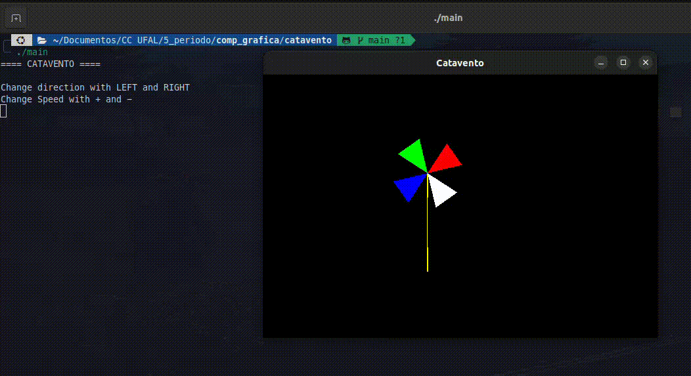

## Animação com Transformações (Catavento)

Aplica composição de transformações de translação e rotação para permitir que os triângulos girem em torno de um ponto central

```cpp
glTranslatef(CENTER_X, CENTER_Y, 0);
glRotatef(ANGLE, 0.0, 0.0, 1.0);
glTranslatef(-CENTER_X, -CENTER_Y, 0);
```


